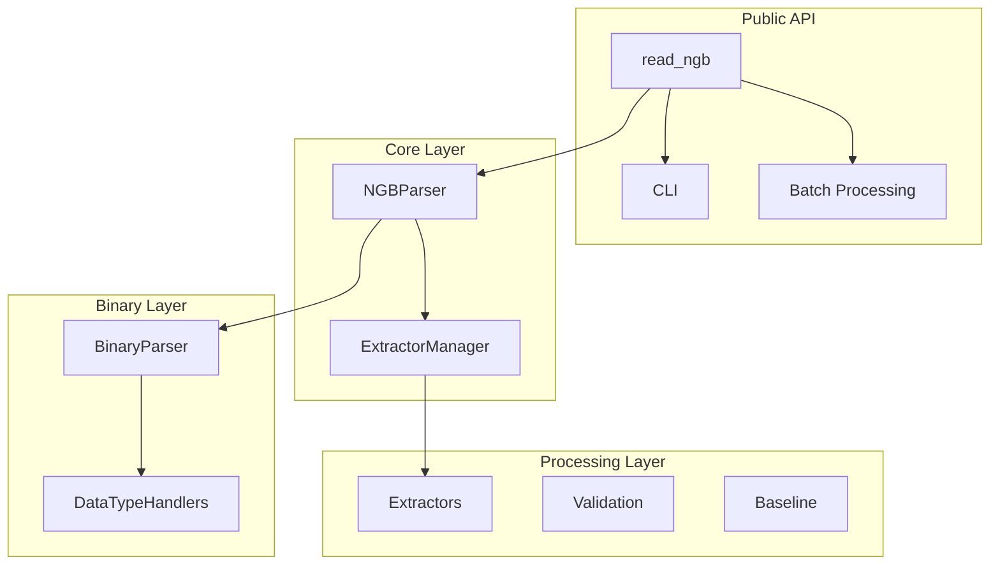

# pyNGB Improvement Plan

A staged implementation plan for code quality improvements based on comprehensive code review.

---

## Overview

This document outlines a phased approach to implementing improvements identified in the pyNGB code review. The plan is organized into 5 stages, progressing from critical fixes to nice-to-have enhancements.

**Estimated Total Effort:** 3-4 weeks
**Risk Level:** Low (incremental changes with test coverage)

---

## Stage 1: Critical Fixes (Priority: Immediate)

**Goal:** Fix bugs and reliability issues that could cause production problems.
**Estimated Effort:** 1-2 days

### 1.1 Fix Mutable Default Arguments

**File:** `src/pyngb/util.py:18`

**Current Code:**
```python
def set_metadata(
    tbl, col_meta: dict[str, Any] = {}, tbl_meta: dict[str, Any] = {}
) -> pa.Table:
```

**Fixed Code:**
```python
def set_metadata(
    tbl,
    col_meta: dict[str, Any] | None = None,
    tbl_meta: dict[str, Any] | None = None
) -> pa.Table:
    col_meta = col_meta if col_meta is not None else {}
    tbl_meta = tbl_meta if tbl_meta is not None else {}
```

**Tasks:**
- [ ] Update `set_metadata()` function signature
- [ ] Search for other mutable default arguments in codebase
- [ ] Add tests for default argument behavior
- [ ] Update ruff config to enable B006 rule (remove from ignore list)

---

### 1.2 Add Configuration Validation

**Files:** `src/pyngb/constants.py`, new file `src/pyngb/config_validation.py`

**Problem:** No validation for configuration thresholds. Invalid configs silently break functionality.

**Implementation:**

```python
# src/pyngb/config_validation.py
"""Configuration validation for pyNGB constants and thresholds."""

from __future__ import annotations

import logging
from dataclasses import fields, is_dataclass
from typing import Any

logger = logging.getLogger(__name__)


class ConfigurationError(Exception):
    """Raised when configuration validation fails."""
    pass


def validate_thresholds() -> None:
    """Validate ValidationThresholds configuration at import time."""
    from pyngb.constants import ValidationThresholds

    errors = []

    # Temperature bounds
    if ValidationThresholds.MIN_TEMPERATURE >= ValidationThresholds.MAX_TEMPERATURE:
        errors.append(
            f"MIN_TEMPERATURE ({ValidationThresholds.MIN_TEMPERATURE}) must be "
            f"less than MAX_TEMPERATURE ({ValidationThresholds.MAX_TEMPERATURE})"
        )

    # Physical constraints
    if ValidationThresholds.MIN_TEMPERATURE < -273.15:
        errors.append(
            f"MIN_TEMPERATURE ({ValidationThresholds.MIN_TEMPERATURE}) cannot be "
            "below absolute zero (-273.15°C)"
        )

    # Mass constraints
    if ValidationThresholds.MIN_MASS < 0:
        errors.append(
            f"MIN_MASS ({ValidationThresholds.MIN_MASS}) cannot be negative"
        )

    if ValidationThresholds.MAX_MASS <= ValidationThresholds.MIN_MASS:
        errors.append(
            f"MAX_MASS ({ValidationThresholds.MAX_MASS}) must be greater than "
            f"MIN_MASS ({ValidationThresholds.MIN_MASS})"
        )

    if errors:
        raise ConfigurationError(
            "Invalid configuration detected:\n" + "\n".join(f"  - {e}" for e in errors)
        )


def validate_pattern_config(config: Any) -> None:
    """Validate PatternConfig column map hex IDs."""
    if not hasattr(config, 'column_map'):
        return

    errors = []
    for hex_id, column_name in config.column_map.items():
        try:
            int(hex_id, 16)
        except ValueError:
            errors.append(f"Invalid hex column ID '{hex_id}' for column '{column_name}'")

    if errors:
        raise ConfigurationError(
            "Invalid PatternConfig:\n" + "\n".join(f"  - {e}" for e in errors)
        )


def validate_all_configs() -> None:
    """Run all configuration validations. Called at module import."""
    validate_thresholds()

    from pyngb.constants import DEFAULT_PATTERN_CONFIG
    validate_pattern_config(DEFAULT_PATTERN_CONFIG)

    logger.debug("All configuration validations passed")


# Run validation at import time
validate_all_configs()
```

**Tasks:**
- [ ] Create `src/pyngb/config_validation.py`
- [ ] Add `ConfigurationError` to `exceptions.py`
- [ ] Import validation module in `__init__.py`
- [ ] Add comprehensive tests for config validation
- [ ] Document configuration constraints

---

### 1.3 Replace Broad Exception Catches

**Files:** Multiple locations

| File | Line | Current | Replacement |
|------|------|---------|-------------|
| `util.py` | 98-130 | `except Exception` | `except (OSError, RuntimeError)` |
| `binary/handlers.py` | 154-179 | `except Exception` | `except (ValueError, struct.error)` |
| `core/parser.py` | 159-167 | `except Exception` | `except (KeyError, ValueError, NGBParseError)` |
| `batch.py` | 80-93 | `except Exception` | `except (NGBParseError, OSError, ValueError)` |

**Tasks:**
- [ ] Audit all `except Exception` blocks
- [ ] Identify specific exceptions that can occur
- [ ] Replace with specific exception types
- [ ] Add logging for unexpected exceptions
- [ ] Add tests for error handling paths

---

## Stage 2: Type Safety & Error Handling (Priority: High)

**Goal:** Complete type coverage and improve error handling consistency.
**Estimated Effort:** 3-5 days

### 2.1 Enable Strict Type Checking

**File:** `pyproject.toml`

**Current:**
```toml
[tool.mypy]
disallow_untyped_defs = false
```

**Target:**
```toml
[tool.mypy]
disallow_untyped_defs = true
warn_return_any = true
warn_unused_ignores = true
strict_optional = true
```

**Tasks:**
- [ ] Run `uv run mypy src/pyngb --strict` to identify gaps
- [ ] Add type hints to all public functions first
- [ ] Add type hints to internal functions
- [ ] Fix all mypy errors
- [ ] Enable strict mode in CI

**Priority Files (add types first):**
1. `api/loaders.py` - Public API
2. `core/parser.py` - Core functionality
3. `validation.py` - Data validation
4. `baseline.py` - Baseline processing
5. `batch.py` - Batch operations

---

### 2.2 Improve FileMetadata TypedDict

**File:** `src/pyngb/constants.py:30-31`

**Current:**
```python
class FileMetadata(TypedDict, total=False):
    """All fields optional"""
    instrument: str
    sample_name: str
    # ... 60+ fields
```

**Improved:**
```python
class FileMetadataRequired(TypedDict):
    """Required metadata fields always present after parsing."""
    instrument: str
    sample_name: str
    file_hash: str


class FileMetadata(FileMetadataRequired, total=False):
    """Complete file metadata with optional fields."""
    material: str
    operator: str
    project: str
    # ... remaining optional fields
```

**Tasks:**
- [ ] Identify which fields are always present
- [ ] Create required/optional TypedDict split
- [ ] Update extractors to guarantee required fields
- [ ] Add runtime validation for required fields
- [ ] Update documentation

---

### 2.3 Create Specific Exception Types

**File:** `src/pyngb/exceptions.py`

**New Exceptions to Add:**
```python
class NGBConfigurationError(NGBParseError):
    """Configuration validation failed."""
    pass


class NGBMetadataExtractionError(NGBParseError):
    """Failed to extract metadata from binary stream."""
    pass


class NGBBaselineError(NGBParseError):
    """Baseline subtraction operation failed."""
    pass


class NGBValidationError(NGBParseError):
    """Data validation failed."""

    def __init__(self, message: str, errors: list[str] | None = None):
        super().__init__(message)
        self.errors = errors or []


class NGBResourceLimitError(NGBParseError):
    """Resource limit exceeded (file size, memory, etc.)."""
    pass
```

**Tasks:**
- [ ] Add new exception classes
- [ ] Replace generic `ValueError` raises with specific types
- [ ] Update docstrings to document raised exceptions
- [ ] Add tests for each exception type

---

## Stage 3: Code Organization & Modularity (Priority: Medium)

**Goal:** Improve maintainability through better code organization.
**Estimated Effort:** 3-5 days

### 3.1 Decompose CLI Main Function

**File:** `src/pyngb/api/loaders.py:227-380`

**Current:** 153-line monolithic function

**Proposed Structure:**
```python
# src/pyngb/api/cli.py (new file)
"""Command-line interface for pyNGB."""

from __future__ import annotations

import argparse
import sys
from pathlib import Path
from typing import NoReturn

from pyngb.api.loaders import read_ngb
from pyngb.exceptions import NGBParseError


def create_parser() -> argparse.ArgumentParser:
    """Create and configure argument parser."""
    parser = argparse.ArgumentParser(
        prog="pyngb",
        description="Parse NETZSCH NGB files"
    )
    # ... argument definitions
    return parser


def validate_inputs(args: argparse.Namespace) -> None:
    """Validate input files and options."""
    input_path = Path(args.input)
    if not input_path.exists():
        raise FileNotFoundError(f"Input file not found: {input_path}")

    if args.baseline:
        baseline_path = Path(args.baseline)
        if not baseline_path.exists():
            raise FileNotFoundError(f"Baseline file not found: {baseline_path}")


def process_single_file(args: argparse.Namespace) -> int:
    """Process a single NGB file."""
    # ... implementation
    return 0


def process_batch(args: argparse.Namespace) -> int:
    """Process multiple NGB files."""
    # ... implementation
    return 0


def write_output(data, args: argparse.Namespace) -> None:
    """Write processed data to output file."""
    # ... implementation


def main(argv: list[str] | None = None) -> int:
    """Main CLI entry point."""
    parser = create_parser()
    args = parser.parse_args(argv)

    try:
        validate_inputs(args)

        if args.batch:
            return process_batch(args)
        return process_single_file(args)

    except FileNotFoundError as e:
        print(f"Error: {e}", file=sys.stderr)
        return 1
    except NGBParseError as e:
        print(f"Parse error: {e}", file=sys.stderr)
        return 2


if __name__ == "__main__":
    sys.exit(main())
```

**Tasks:**
- [ ] Create `src/pyngb/api/cli.py`
- [ ] Move CLI logic from `loaders.py`
- [ ] Update entry point in `pyproject.toml`
- [ ] Update imports in `__main__.py`
- [ ] Maintain backward compatibility
- [ ] Update CLI tests

---

### 3.2 Split QualityChecker Class

**File:** `src/pyngb/validation.py:140-587` (447 lines, 18 methods)

**Proposed Structure:**
```
src/pyngb/validation/
├── __init__.py          # Public API exports
├── base.py              # ValidationResult, base classes
├── structure.py         # StructureValidator
├── temperature.py       # TemperatureValidator
├── mass.py              # MassValidator
├── dsc.py               # DSCValidator
├── metadata.py          # MetadataValidator
└── checker.py           # QualityChecker (orchestrates validators)
```

**Tasks:**
- [ ] Create `validation/` subpackage
- [ ] Extract validators by domain
- [ ] Create `ValidatorProtocol` for consistency
- [ ] Update `QualityChecker` to compose validators
- [ ] Maintain public API compatibility
- [ ] Update tests

---

### 3.3 Split Utility Module

**File:** `src/pyngb/util.py`

**Current:** Mixed responsibilities (metadata, hashing, column utils)

**Proposed:**
```
src/pyngb/
├── util/
│   ├── __init__.py      # Re-export public functions
│   ├── metadata.py      # Arrow metadata operations
│   ├── hashing.py       # File hash utilities
│   └── columns.py       # Column metadata helpers
```

**Tasks:**
- [ ] Create `util/` subpackage
- [ ] Split functions by responsibility
- [ ] Update imports throughout codebase
- [ ] Maintain backward compatibility via `__init__.py`

---

### 3.4 Centralize Configuration

**New File:** `src/pyngb/config.py`

```python
"""Centralized configuration for pyNGB."""

from __future__ import annotations

from dataclasses import dataclass, field
from typing import Any


@dataclass(frozen=True)
class ParsingConfig:
    """Configuration for binary parsing."""
    max_file_size_mb: int = 1000
    max_tables_per_stream: int = 100
    max_array_size_mb: int = 500
    encoding_fallback: str = "utf-8"


@dataclass(frozen=True)
class ValidationConfig:
    """Configuration for data validation."""
    min_temperature: float = -200.0
    max_temperature: float = 2000.0
    min_mass: float = 0.0
    max_mass: float = 10000.0
    max_mass_loss_rate: float = 100.0  # mg/min


@dataclass(frozen=True)
class BatchConfig:
    """Configuration for batch processing."""
    max_workers: int | None = None  # None = cpu_count
    chunk_size: int = 10
    max_memory_gb: float = 4.0
    skip_errors: bool = False


@dataclass
class PyNGBConfig:
    """Main configuration container."""
    parsing: ParsingConfig = field(default_factory=ParsingConfig)
    validation: ValidationConfig = field(default_factory=ValidationConfig)
    batch: BatchConfig = field(default_factory=BatchConfig)

    def __post_init__(self) -> None:
        """Validate configuration after initialization."""
        self._validate()

    def _validate(self) -> None:
        """Run all configuration validations."""
        if self.validation.min_temperature >= self.validation.max_temperature:
            raise ValueError("min_temperature must be less than max_temperature")
        # ... additional validations


# Global default configuration
DEFAULT_CONFIG = PyNGBConfig()
```

**Tasks:**
- [ ] Create `src/pyngb/config.py`
- [ ] Migrate constants to config classes
- [ ] Add `__post_init__` validation
- [ ] Update functions to accept config parameter
- [ ] Add config override support via environment variables
- [ ] Document configuration options

---

## Stage 4: Testing & Documentation (Priority: Medium)

**Goal:** Improve test coverage and documentation quality.
**Estimated Effort:** 3-5 days

### 4.1 Add Property-Based Testing

**New File:** `tests/test_property_based.py`

```python
"""Property-based tests using Hypothesis."""

import pytest
from hypothesis import given, strategies as st, settings

from pyngb.binary.parser import BinaryParser


class TestBinaryParserProperties:
    """Property-based tests for binary parsing."""

    @given(st.binary(min_size=0, max_size=10000))
    @settings(max_examples=1000)
    def test_split_tables_never_crashes(self, data: bytes) -> None:
        """split_tables should handle any input without crashing."""
        parser = BinaryParser()
        result = parser.split_tables(data)
        assert isinstance(result, list)

    @given(st.binary(min_size=4, max_size=1000))
    def test_parse_value_returns_valid_type(self, data: bytes) -> None:
        """parse_value should return expected types or None."""
        # ... implementation

    @given(st.lists(st.floats(allow_nan=False, allow_infinity=False), min_size=2))
    def test_dtg_calculation_properties(self, values: list[float]) -> None:
        """DTG calculation should preserve data length relationships."""
        # ... implementation
```

**Tasks:**
- [ ] Add `hypothesis` to test dependencies
- [ ] Create `tests/test_property_based.py`
- [ ] Add property tests for binary parsing
- [ ] Add property tests for DTG calculations
- [ ] Add property tests for validation functions
- [ ] Configure hypothesis profiles for CI

---

### 4.2 Add Performance Regression Tests

**File:** `tests/test_performance.py`

```python
"""Performance regression tests."""

import pytest


@pytest.mark.benchmark
class TestPerformanceRegression:
    """Ensure performance doesn't regress."""

    def test_parse_file_performance(self, benchmark, sample_ngb_file):
        """Parsing should complete within acceptable time."""
        from pyngb import read_ngb

        result = benchmark(read_ngb, sample_ngb_file)

        # Assert performance bounds
        assert benchmark.stats['mean'] < 1.0  # seconds
        assert benchmark.stats['max'] < 2.0   # seconds

    def test_batch_processing_throughput(self, benchmark, sample_ngb_files):
        """Batch processing should maintain throughput."""
        from pyngb.batch import process_batch

        result = benchmark(process_batch, sample_ngb_files)

        files_per_second = len(sample_ngb_files) / benchmark.stats['mean']
        assert files_per_second > 5  # Minimum throughput
```

**Tasks:**
- [ ] Create `tests/test_performance.py`
- [ ] Add benchmark fixtures
- [ ] Define performance thresholds
- [ ] Add to CI as separate job
- [ ] Track performance over time

---

### 4.3 Create Architecture Documentation

**New File:** `docs/architecture.md`

```markdown
# pyNGB Architecture

## Overview

pyNGB uses a layered architecture with clear separation of concerns.

## Layer Diagram



## Data Flow

1. **Input**: NGB file (ZIP archive)
2. **Extraction**: Unzip and read binary streams
3. **Parsing**: Binary → structured data
4. **Metadata**: Extract from binary patterns
5. **Validation**: Quality checks
6. **Output**: PyArrow Table with metadata

## Key Design Decisions

### Why PyArrow + Polars?
- PyArrow: Zero-copy interop, Parquet I/O, schema metadata
- Polars: Fast DataFrame operations, lazy evaluation

### Why Extractors Pattern?
- Single Responsibility: Each extractor handles one domain
- Testability: Extractors are independently testable
- Extensibility: New extractors without core changes
```

**Tasks:**
- [ ] Create `docs/architecture.md`
- [ ] Add Mermaid diagrams
- [ ] Document data flow
- [ ] Document key design decisions
- [ ] Add to MkDocs navigation

---

### 4.4 Document Binary Format

**New File:** `docs/binary-format.md`

Document the NGB binary format for maintainability:

```markdown
# NGB Binary Format Reference

## File Structure

NGB files are ZIP archives containing:
- `Streams/stream_1.table` - Metadata stream
- `Streams/stream_2.table` - Data stream
- `Streams/stream_3.table` - Optional auxiliary data

## Binary Markers

| Marker | Hex | Purpose |
|--------|-----|---------|
| START_DATA | `00 00 08 80 07` | Data block start |
| END_TABLE | `FF FE FF 00 00` | Table terminator |
| TABLE_SEP | `FF FE FF 04` | Table separator |

## String Encoding

### Standard String (4-byte length prefix)
```
[4 bytes: length][N bytes: UTF-8 data]
```

### UTF-16LE String
```
[4 bytes: length][N*2 bytes: UTF-16LE data]
```

## Data Types

| Type ID | Format | Description |
|---------|--------|-------------|
| 0x0B | float64[] | Double array |
| 0x08 | int32 | 32-bit integer |
| 0x09 | int64 | 64-bit integer |
```

**Tasks:**
- [ ] Create `docs/binary-format.md`
- [ ] Document all binary markers
- [ ] Document string encoding formats
- [ ] Add hex dumps with annotations
- [ ] Document how markers were discovered

---

## Stage 5: Enhancements (Priority: Low)

**Goal:** Nice-to-have improvements for developer experience.
**Estimated Effort:** 2-3 days

### 5.1 Add Resource Limits

**File:** `src/pyngb/config.py` (extend from Stage 3)

```python
@dataclass(frozen=True)
class ResourceLimits:
    """Resource limits to prevent DoS and memory issues."""
    max_file_size_mb: int = 1000
    max_tables_per_stream: int = 100
    max_array_elements: int = 10_000_000
    max_batch_memory_gb: float = 4.0
    max_concurrent_files: int = 100


def check_resource_limits(
    file_path: Path,
    limits: ResourceLimits = ResourceLimits()
) -> None:
    """Check file against resource limits before processing."""
    file_size_mb = file_path.stat().st_size / (1024 * 1024)

    if file_size_mb > limits.max_file_size_mb:
        raise NGBResourceLimitError(
            f"File size ({file_size_mb:.1f} MB) exceeds limit "
            f"({limits.max_file_size_mb} MB)"
        )
```

**Tasks:**
- [ ] Add `ResourceLimits` dataclass
- [ ] Add limit checking functions
- [ ] Integrate into parsing pipeline
- [ ] Add configuration via environment variables
- [ ] Document resource limits

---

### 5.2 Add Path Traversal Validation

**File:** `src/pyngb/util/paths.py` (new)

```python
"""Path validation utilities."""

from pathlib import Path


def validate_output_path(
    output_path: Path,
    allowed_base: Path | None = None
) -> Path:
    """Validate output path is safe and within allowed directory."""
    resolved = output_path.resolve()

    if allowed_base is not None:
        allowed_resolved = allowed_base.resolve()
        if not resolved.is_relative_to(allowed_resolved):
            raise ValueError(
                f"Output path '{resolved}' escapes allowed directory "
                f"'{allowed_resolved}'"
            )

    return resolved
```

**Tasks:**
- [ ] Create path validation utilities
- [ ] Add to batch export functions
- [ ] Add to CLI output handling
- [ ] Add tests for path traversal attempts

---

### 5.3 Improve Logging Strategy

**New File:** `src/pyngb/logging_config.py`

```python
"""Logging configuration for pyNGB."""

import logging
import sys
from typing import Literal

LogLevel = Literal["DEBUG", "INFO", "WARNING", "ERROR"]


def configure_logging(
    level: LogLevel = "WARNING",
    format: str = "%(name)s - %(levelname)s - %(message)s",
    stream=sys.stderr
) -> None:
    """Configure logging for pyNGB.

    Call this function to enable logging output from pyNGB.
    By default, pyNGB uses NullHandler and produces no output.

    Example:
        >>> import pyngb
        >>> pyngb.configure_logging(level="DEBUG")
        >>> # Now pyNGB will output debug information
    """
    logger = logging.getLogger("pyngb")
    logger.setLevel(getattr(logging, level))

    handler = logging.StreamHandler(stream)
    handler.setFormatter(logging.Formatter(format))
    logger.addHandler(handler)
```

**Tasks:**
- [ ] Create logging configuration module
- [ ] Export `configure_logging` from package root
- [ ] Document logging setup in user guide
- [ ] Add structured logging option (JSON)

---

### 5.4 Add Binary Test Data Builders

**File:** `tests/builders.py`

```python
"""Test data builders for binary parsing tests."""

from __future__ import annotations

import struct
from dataclasses import dataclass, field


@dataclass
class NGBBinaryBuilder:
    """Builder for creating test NGB binary data."""

    _data: bytearray = field(default_factory=bytearray)

    def add_marker(self, marker: bytes) -> "NGBBinaryBuilder":
        """Add a binary marker."""
        self._data.extend(marker)
        return self

    def add_string(self, value: str, encoding: str = "utf-8") -> "NGBBinaryBuilder":
        """Add a length-prefixed string."""
        encoded = value.encode(encoding)
        self._data.extend(struct.pack("<I", len(encoded)))
        self._data.extend(encoded)
        return self

    def add_float_array(self, values: list[float]) -> "NGBBinaryBuilder":
        """Add a float64 array."""
        for v in values:
            self._data.extend(struct.pack("<d", v))
        return self

    def build(self) -> bytes:
        """Build the final binary data."""
        return bytes(self._data)


# Usage in tests:
# data = (NGBBinaryBuilder()
#     .add_marker(START_DATA)
#     .add_string("Sample Name")
#     .add_float_array([1.0, 2.0, 3.0])
#     .build())
```

**Tasks:**
- [ ] Create `tests/builders.py`
- [ ] Add builders for common binary structures
- [ ] Update existing tests to use builders
- [ ] Document builder usage

---

## Implementation Schedule

| Stage | Description | Priority | Effort | Dependencies |
|-------|-------------|----------|--------|--------------|
| 1 | Critical Fixes | Immediate | 1-2 days | None |
| 2 | Type Safety & Errors | High | 3-5 days | Stage 1 |
| 3 | Code Organization | Medium | 3-5 days | Stage 2 |
| 4 | Testing & Docs | Medium | 3-5 days | Stage 3 |
| 5 | Enhancements | Low | 2-3 days | Stage 4 |

---

## Validation Checklist

After each stage, verify:

- [ ] All existing tests pass: `uv run pytest`
- [ ] Type checking passes: `uv run mypy src/pyngb`
- [ ] Linting passes: `uv run ruff check src/`
- [ ] Documentation builds: `uv run mkdocs build`
- [ ] No new security issues: `uv run bandit -r src/`

---

## Risk Mitigation

| Risk | Mitigation |
|------|------------|
| Breaking API changes | Maintain backward compatibility via re-exports |
| Test failures | Run full test suite after each change |
| Performance regression | Run benchmarks before/after each stage |
| Merge conflicts | Small, focused PRs for each task |

---

## Success Metrics

| Metric | Current | Target |
|--------|---------|--------|
| Type hint coverage | ~60-70% | 100% |
| Test coverage | ~85% | 90%+ |
| Mypy strict mode | Disabled | Enabled |
| Ruff B006 rule | Ignored | Enabled |
| Configuration validation | None | Complete |

---

## Notes

- Each stage should be a separate PR for easier review
- Create feature branch per stage: `improvement/stage-N-description`
- Update CHANGELOG.md with each merged stage
- Consider version bump after Stage 2 (minor version for type improvements)
