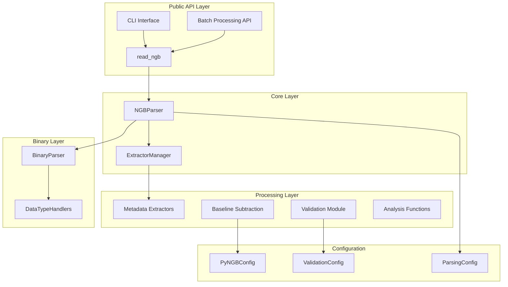
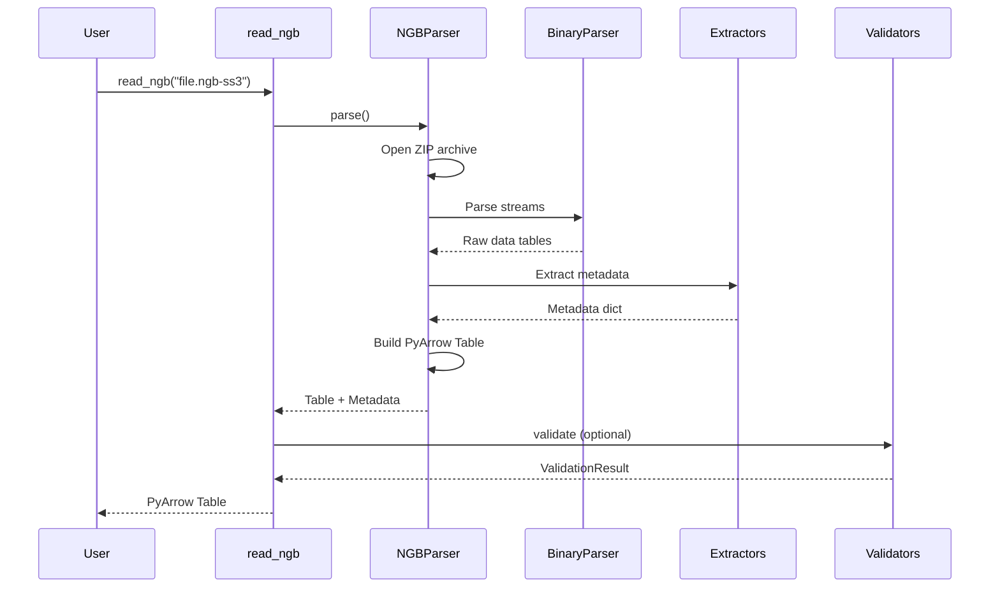

# pyNGB Architecture

## Overview

pyNGB uses a layered architecture with clear separation of concerns. The library is designed to parse proprietary NETZSCH STA (Simultaneous Thermal Analysis) NGB binary files and convert them into structured, analyzable data formats.

## System Architecture

### Layer Diagram



## Data Flow

### File Parsing Pipeline

1. **Input**: NGB file (ZIP archive containing binary streams)
2. **Extraction**: Unzip and read binary streams
3. **Binary Parsing**: Convert binary data to structured values
4. **Metadata Extraction**: Parse file and column metadata from streams
5. **Table Construction**: Build PyArrow Table with data and metadata
6. **Validation** (optional): Quality checks on parsed data
7. **Output**: PyArrow Table with embedded metadata

### Detailed Flow



## Module Organization

### Core Modules

#### `pyngb.core.parser` - NGBParser
**Responsibility**: Main orchestrator for file parsing
- Opens and validates NGB ZIP archives
- Coordinates binary parsing and metadata extraction
- Constructs final PyArrow tables

**Key Classes**:
- `NGBParser`: Main parsing class

#### `pyngb.binary.parser` - BinaryParser
**Responsibility**: Low-level binary data parsing
- Pattern matching for binary markers
- Type-specific data extraction
- String encoding/decoding (UTF-8, UTF-16LE)

**Key Classes**:
- `BinaryParser`: Binary stream parser
- `DataTypeRegistry`: Handler registration and dispatch

#### `pyngb.binary.handlers` - DataTypeHandlers
**Responsibility**: Type-specific binary parsing
- Float64/Float32 array parsing
- String extraction and decoding
- Extensible handler protocol

**Key Classes**:
- `Float64Handler`
- `Float32Handler`
- `DataTypeHandlerProtocol`

### Processing Modules

#### `pyngb.extractors` - Metadata Extractors
**Responsibility**: Domain-specific metadata extraction
- File-level metadata (instrument, sample info)
- Column-level metadata (units, processing history)
- Calibration constants
- Temperature programs

**Key Classes**:
- `FileMetadataExtractor`
- `ColumnMetadataExtractor`
- `CalibrationExtractor`
- `TemperatureProgramExtractor`

#### `pyngb.validation` - Data Validation
**Responsibility**: Quality assurance for parsed data
- Structural validation (required columns, data types)
- Physical validity (temperature ranges, mass values)
- Statistical outlier detection
- Metadata consistency checks

**Key Classes**:
- `QualityChecker`: Orchestrates all validators
- `StructureValidator`
- `TemperatureValidator`
- `MassValidator`
- `DSCValidator`
- `ValidationResult`: Stores findings

#### `pyngb.baseline` - Baseline Subtraction
**Responsibility**: Baseline correction for thermal analysis
- Dynamic segment alignment
- Interpolation and subtraction
- Temperature program validation

**Key Classes**:
- `BaselineSubtractor`
- `subtract_baseline()` convenience function

#### `pyngb.analysis` - Analysis Functions
**Responsibility**: Derived quantities and transformations
- DTG (derivative thermogravimetry) calculation
- Mass normalization
- DSC calibration application

**Key Functions**:
- `dtg()`: Savitzky-Golay based DTG
- `dtg_custom()`: Custom DTG parameters
- `add_dtg()`: Add DTG column to table
- `normalize_to_initial_mass()`: Percentage mass normalization

### API Modules

#### `pyngb.api.loaders` - Data Loading
**Responsibility**: High-level data loading interface
- `read_ngb()`: Main entry point for file reading
- Baseline subtraction integration
- Metadata return options

#### `pyngb.api.cli` - Command Line Interface
**Responsibility**: CLI for file conversion
- Argument parsing and validation
- Output format selection (Parquet, CSV)
- Batch file processing

#### `pyngb.batch` - Batch Processing
**Responsibility**: Multi-file processing
- Parallel processing with worker pools
- Progress tracking and error handling
- Dataset aggregation and export

**Key Classes**:
- `BatchProcessor`: Parallel file processing
- `NGBDataset`: Dataset management and analysis

### Configuration

#### `pyngb.config` - Configuration Management
**Responsibility**: Centralized configuration
- Parsing limits (file size, array size)
- Validation thresholds (temperature, mass)
- Batch processing settings (workers, memory)

**Key Classes**:
- `PyNGBConfig`: Main configuration container
- `ParsingConfig`: Binary parsing settings
- `ValidationConfig`: Validation thresholds
- `BatchConfig`: Batch processing settings

## Key Design Decisions

### Why PyArrow + Polars?

**PyArrow**:
- Zero-copy interop with other Arrow-based tools
- Efficient Parquet I/O for large datasets
- Schema metadata embedding
- Column-level metadata support

**Polars**:
- Fast DataFrame operations (Rust-based)
- Lazy evaluation for query optimization
- Better memory efficiency than Pandas
- Native Arrow support

### Why Extractors Pattern?

**Benefits**:
- **Single Responsibility**: Each extractor handles one metadata domain
- **Testability**: Extractors can be tested in isolation
- **Extensibility**: New extractors can be added without modifying core
- **Maintainability**: Smaller, focused classes are easier to understand

**Tradeoffs**:
- More files to manage
- Slight overhead from composition
- Need for careful interface design

### Why Frozen Dataclasses for Config?

**Benefits**:
- Immutability prevents accidental modification
- Type safety with automatic validation
- Clear configuration structure
- Easy to serialize/deserialize

**Implementation**:
```python
@dataclass(frozen=True)
class ParsingConfig:
    max_file_size_mb: int = 1000
    max_array_size_mb: int = 500

    def __post_init__(self) -> None:
        if self.max_file_size_mb <= 0:
            raise ValueError("max_file_size_mb must be positive")
```

### Why Validator Composition?

**Before (Monolithic)**:
```python
class QualityChecker:
    def full_validation(self):
        self._check_structure()      # 50 lines
        self._check_temperature()    # 80 lines
        self._check_mass()           # 100 lines
        # ... 10 more methods
```

**After (Composition)**:
```python
class QualityChecker:
    def full_validation(self):
        StructureValidator(df).validate(result)
        TemperatureValidator(df).validate(result)
        MassValidator(df, metadata).validate(result)
        # ... compose validators
```

**Benefits**:
- Each validator is independently testable
- Easier to add/remove validation checks
- Clear separation of concerns
- Validators can be reused in different contexts

## Performance Considerations

### Memory Efficiency
- Use memory-mapped files for large arrays
- Stream-based ZIP reading
- Lazy DataFrame evaluation where possible
- Configurable memory limits

### Parsing Speed
- Compiled regex patterns (cached)
- Vectorized operations with NumPy
- Parallel batch processing
- Minimal data copying

### Benchmarks
Typical performance on modern hardware:
- Single file parsing: ~0.5-1.0 seconds (500KB file)
- Batch processing: ~5-10 files/second
- DTG calculation: ~50ms (10,000 points)
- Full validation: ~100ms (typical dataset)

## Error Handling Strategy

### Exception Hierarchy
```
NGBParseError (base)
├── NGBCorruptedFileError
├── NGBUnsupportedVersionError
├── NGBDataTypeError
├── NGBStreamNotFoundError
├── NGBMetadataExtractionError
├── NGBBaselineError
├── NGBValidationError
├── NGBResourceLimitError
└── NGBConfigurationError
```

### Error Recovery
- Batch processing continues on individual file errors
- Validation warnings don't stop processing
- Graceful degradation for missing metadata
- Clear error messages with context

## Testing Strategy

### Test Categories
1. **Unit Tests**: Individual function/class testing
2. **Integration Tests**: Full parsing pipeline
3. **Property-Based Tests**: Hypothesis-driven edge cases
4. **Performance Tests**: Regression detection
5. **Stress Tests**: Large files, concurrent access

### Test Coverage
- Target: >90% code coverage
- Critical paths: 100% coverage
- Edge cases: Property-based tests
- Performance: Benchmark suite

## Future Considerations

### Potential Enhancements
- Streaming API for very large files
- Incremental parsing for live data
- Plugin system for custom extractors
- SQL query interface via DuckDB
- Cloud storage integration (S3, GCS)

### Scalability
- Current: Single machine, multi-core
- Future: Distributed processing (Dask, Ray)
- Database: Direct export to analytical databases
