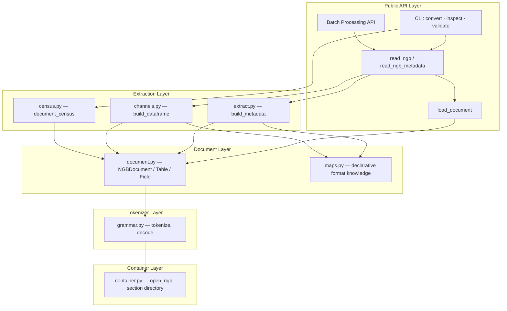
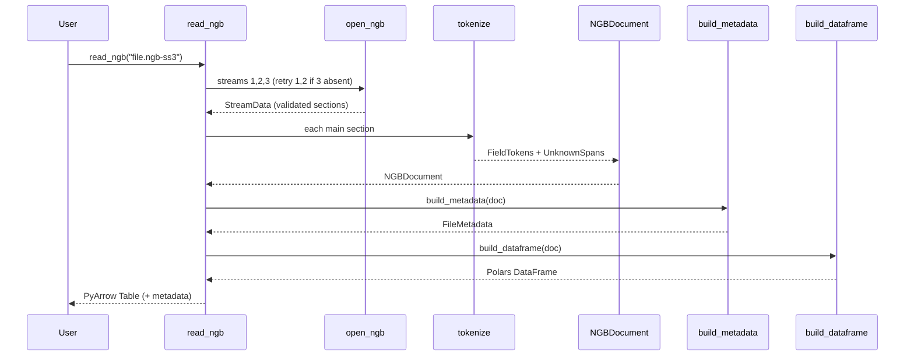

# pyNGB Architecture

## Overview

pyNGB parses proprietary NETZSCH STA (Simultaneous Thermal Analysis) NGB
binary files into structured, analyzable data. Since 0.4.0 the backbone is a
**strict record-grammar tokenizer**: each stream is parsed once, in full, into
a queryable document, and every extraction rule is a lookup over that document.

Three invariants shape the design:

1. **One grammar, one tokenizer — total.** Every byte of a stream section is
   either a decoded record or an explicit, classified `UnknownSpan`; nothing
   is silently skipped.
2. **Severity policy lives in consumers, not the tokenizer.** Data streams
   hard-error on malformed spans; metadata streams warn and proceed (every
   metadata field is optional by contract).
3. **Declarative format knowledge.** All byte constants live in one module
   (`grammar`), all field mappings in another (`maps`); adding a metadata
   field means adding a map entry or one plain function, never touching the
   tokenizer.

## System Architecture

### Layer Diagram


```mermaid
graph TB
    subgraph "Public API Layer"
        A[read_ngb / read_ngb_metadata]
        B[CLI: convert · inspect · validate]
        C[Batch Processing API]
        L[load_document]
    end

    subgraph "Extraction Layer"
        E[extract.py — build_metadata]
        F[channels.py — build_dataframe]
        G[census.py — document_census]
    end

    subgraph "Document Layer"
        D[document.py — NGBDocument / Table / Field]
        M[maps.py — declarative format knowledge]
    end

    subgraph "Tokenizer Layer"
        T[grammar.py — tokenize, decode]
    end

    subgraph "Container Layer"
        K[container.py — open_ngb, section directory]
    end

    A --> E
    A --> F
    B --> A
    B --> G
    C --> A
    L --> D
    A --> L
    E --> D
    F --> D
    G --> D
    E --> M
    F --> M
    D --> T
    T --> K
```

The `pyngb.format` package is **strictly layered**: each module imports only
from layers below it. `ParsingConfig` (resource limits) threads through every
layer as the optional `limits=` argument.

## The `pyngb.format` package

| Module | Responsibility |
|--------|----------------|
| `container.py` | ZIP opening with error translation, pre-decompression `max_stream_size_mb` check, magic validation, section-directory parsing with hard integrity checks (contiguity, EOF, main section present). Returns `StreamData` per stream. |
| `grammar.py` | Single source of byte-level truth: record header/END_FIELD constants, `DType`/`Mode` enums, `ITEM_SIZE`, string decoders, scalar/array decoding, and `tokenize()` — the strict linear walk emitting `FieldToken | UnknownSpan`. Never raises on corruption (only `NGBResourceLimitError` on oversized declared arrays). |
| `document.py` | Assembles tokens into `Table` objects (category, type_ref, unique-keyed fields) and the queryable `NGBDocument` (`find`/`first`/`by_category`/`unknown_fields`/`defects`). `load_document()` is the public entry point. |
| `maps.py` | ALL declarative format knowledge: `FIELD_MAP` (metadata key ↔ category/field), `CHANNEL_MAP`, type_ref constants, named field-id groups (PID, stages, calibration, MFC, …). Frozen module-level tables — source edits are the extension point. |
| `extract.py` | `build_metadata(doc) -> FileMetadata`: applies `FIELD_MAP`, then eight plain extractor functions in a tuple, each wrapped in a warn-and-continue net. Adding one function to the tuple = adding an extraction domain. |
| `channels.py` | `build_dataframe(doc) -> pl.DataFrame`: a type_ref state machine over streams 2/3 — channel header tables open channels, segment-value tables append data arrays. Gates hard on any malformed/truncated span in a data stream. |
| `census.py` | `document_census(doc)`: per-stream record/span/coverage accounting and the unknown-field census; powers `pyngb inspect` and the structural test goldens. |

See [Binary Format](binary-format.md) for the grammar itself, the table
object model, and the field catalog that `maps.py` mirrors.

## Data Flow


```mermaid
sequenceDiagram
    participant User
    participant read_ngb
    participant container as open_ngb
    participant tokenizer as tokenize
    participant document as NGBDocument
    participant extract as build_metadata
    participant channels as build_dataframe

    User->>read_ngb: read_ngb("file.ngb-ss3")
    read_ngb->>container: streams 1,2,3 (retry 1,2 if 3 absent)
    container-->>read_ngb: StreamData (validated sections)
    read_ngb->>tokenizer: each main section
    tokenizer-->>document: FieldTokens + UnknownSpans
    document-->>read_ngb: NGBDocument
    read_ngb->>extract: build_metadata(doc)
    extract-->>read_ngb: FileMetadata
    read_ngb->>channels: build_dataframe(doc)
    channels-->>read_ngb: Polars DataFrame
    read_ngb-->>User: PyArrow Table (+ metadata)
```

- `read_ngb` loads streams 1–3 (stream 3 optional), attaches column metadata
  and the BLAKE2b `file_hash`, and optionally performs baseline subtraction.
- `read_ngb_metadata` is the fast path: stream 1 only, same
  `build_metadata`, no data assembly. A parity test guarantees the two paths
  never drift.
- `load_document` exposes the document layer itself — any stream, including
  the unextracted 4–6 — for programmatic exploration.

## Key Design Decisions

### Why a tokenizer instead of pattern matching?

Earlier versions hunted per-field byte patterns over concatenated stream
bytes. That carried a structural false-match risk (a pattern can match inside
an unrelated array payload) and could not enumerate what it *didn't* know.
The tokenizer inverts this: parse everything once, strictly, then extract by
keyed lookup. Unknown fields become a census (`NGBDocument.unknown_fields()`,
`pyngb inspect --unknown`) instead of a search problem, and format drift
fails loudly in the structural test suite.

### Why PyArrow + Polars?

**PyArrow**: zero-copy interop with Arrow-based tools, efficient Parquet
I/O, schema-level and column-level metadata embedding.

**Polars**: fast Rust-based DataFrame assembly during parsing, native Arrow
interchange.

### Why frozen dataclasses and NamedTuples for the model?

`StreamData`, `Table`, `NGBDocument` are frozen dataclasses; `FieldToken`,
`UnknownSpan`, `Field`, `MetaField` are NamedTuples. The document is an
immutable snapshot of the file — extraction cannot accidentally mutate it,
and instances are safe to share across the metadata and data paths.

```python
@dataclass(frozen=True, slots=True)
class ParsingConfig:
    max_stream_size_mb: int = 1000
    max_tables_per_stream: int = 10000
    max_array_size_mb: int = 500
```

### Why validator composition?

`QualityChecker` composes independent validators (`StructureValidator`,
`TemperatureValidator`, `MassValidator`, `DSCValidator`) into one
`ValidationResult` — each independently testable, easy to add or remove, and
a validator crash becomes a finding rather than aborting the run.

## Performance Considerations

### Parsing Speed

- Tokenizer: memoryview-based linear walk, precompiled `struct.Struct`
  unpackers bound to locals, `bytes.find` resync, END_FIELD verified at the
  count-computed position (no scanning).
- Arrays decode via `np.frombuffer` and are **lazy**: `Field.array()`
  decodes on demand, uncached — channel assembly consumes each array exactly
  once.
- The metadata-only path never tokenizes data streams; `read_ngb` never
  loads streams 4–6.

### Benchmarks

Typical performance on modern hardware (398 KB fixture, medians):

- `read_ngb`: ~30 ms; `read_ngb_metadata`: ~18 ms
- Batch processing: dozens of files/second, scaling with worker count
- DTG calculation: ~50 ms (10,000 points); full validation: ~100 ms

Run `uv run python scripts/benchmarks.py` for current numbers.

### Memory Efficiency

- Declared ZIP-member sizes checked **before** decompression
  (decompression-bomb guard); declared array sizes checked before allocation.
- Zero-copy memoryview slices from stream blob to field payload.

## Error Handling Strategy

### Exception Hierarchy

```
NGBParseError (base)
├── NGBCorruptedFileError    # container integrity, data-stream grammar
│                            # violations, channel-assembly mismatches
├── NGBStreamNotFoundError   # required stream missing from the archive
├── NGBResourceLimitError    # ParsingConfig limit exceeded (pre-allocation)
└── NGBDataTypeError         # unknown/invalid data type
```

`NGBCorruptedFileError` carries structured attributes (`stream`, `offset`,
`table_index`, `declared`, `available`); `NGBResourceLimitError` carries
(`stream`, `offset`, `declared`, `limit`). Tests and callers assert on
types and attributes, not message prose.

### Severity policy

- Streams 2/3 (data): malformed or truncated spans are fatal
  (`NGBCorruptedFileError`) — silently wrong columns are worse than no
  columns.
- Stream 1 (metadata): grammar violations warn and extraction continues;
  each extractor is individually wrapped so one failure cannot take down the
  rest.
- Batch processing isolates per-file errors; validation findings never stop
  processing.

## Testing Strategy

1. **Parity goldens**: full metadata + per-column hashes for all six real
   fixtures, pinned with zero tolerances, asserted through both parse paths.
2. **Structural tests**: byte-coverage accounting (every gap byte
   classified), dtype/census goldens, unknown-field census as a format-drift
   tripwire.
3. **Builder-based unit tests**: `tests/support/ngb_builder.py` constructs
   valid NGB bytes; a duality property (`tokenize(build(x)) == x`) keeps the
   builder honest against the real grammar.
4. **Corruption matrix**: truncations, count overruns, directory corruption,
   oversized declarations — each asserting exception type + attributes.
5. **Property-based tests**: round-trips (bitwise float equality) and
   random/mutation fuzzing (any outcome other than a result or
   `NGBParseError` is a bug).
6. **Performance gates**: parse-time ceilings in `test_performance.py`.

Coverage gate: ≥86% (currently ~92%). See
[tests/README.md](https://github.com/GraysonBellamy/pyngb/blob/main/tests/README.md).

## Future Considerations

The document layer is the extension mechanism. Planned directions
(tracked in `FORMAT_FINDINGS.md`):

- Extraction from streams 4–6 (end-of-run snapshot, furnace telemetry,
  embedded EMF plot previews) — each is one function added to
  `extract.py`'s tuple or one API function over the document.
- DSC sensitivity fixpoints, consumables catalog, session identity.
- Baseline auto-discovery via the extracted `correction_file_path`.
